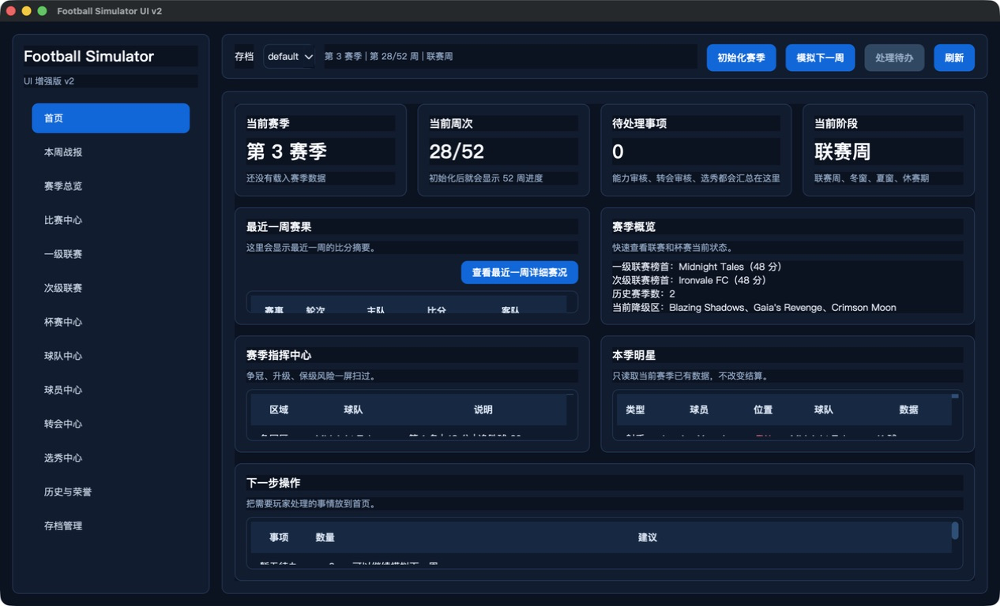

# Football Simulator 综合审视总结与大改实施方案

> 文档日期：2026-08-28  
> 编写模型：OpenAI Codex（GPT-5 系列；当前运行环境未暴露更精确的模型变体名）  
> 文档性质：供后续 agent 直接执行的范围说明、技术方案、任务拆分和验收标准  
> 本文只是一份实施说明，不代表其中修改已经执行。

## 1. 已确认且不可自行解释的产品决定

以下内容来自项目所有审视文档以及用户后续确认。后续 agent 必须把它们视为固定边界，而不是建议。

1. 唯一正式入口是 `ui_v2_main.py -> PySide6 UI v2`。
2. 旧 argparse CLI、Rich 终端 UI、Tkinter GUI 及其专属启动入口可以删除。
3. 本次是一次不兼容的大改，不需要读取、迁移或兼容旧存档。
4. 仓库内旧存档可以删除；不得为旧 `state.json` 编写迁移器或兼容分支。
5. Windows 版本短期冻结：不修复、不重构、不重新打包、不调整说明、不删除其文件。
6. 玩法规则原则上不允许修改。任何规则、概率、公式、赛制、周次或数值平衡变化，必须先形成独立提案，得到用户明确批准后才能实施。
7. 页面设计允许并应当大幅优化，方向是 FM 系列所体现的“高密度足球数据工作台”信息架构；只能借鉴信息组织和交互逻辑，不复制其商标、图标、文案或受版权保护的视觉资产。
8. 球员个人页必须更详细，至少能查看每赛季、每项赛事的数据和每赛季奖项。
9. 新页面不得加入引擎没有模拟的统计。不能为了“像 FM”而虚构分钟、首发、替补、黄红牌、xG、传球、抢断等数据。
10. 任何界面中的球员、球队和比赛都应具有一致的跳转能力：球员到球员页、球队到球队页、已赛比赛到赛后报告、未赛比赛到赛前/赛程页。
11. 舒适性是硬验收项：不得出现“小方框里上下滚动”，不得让外层页面和内部小表格同时承担纵向滚动。

## 2. 审视材料范围

本次重新汇总了 `Reviews` 中现有的全部五份评价，共 663 行：

| 文档 | 主要价值 | 使用方式 |
|---|---|---|
| `project_review_2026-08-25_codex_gpt5.md` | 存档路径、非原子写盘、测试和打包风险 | 作为工程安全与优先级依据 |
| `project_review_2026-08-25_deepseek.md` | 架构概览、旧前端漂移、发布与维护性 | 采用有代码证据支持的部分；排除其与仓库实况冲突的个别判断 |
| `project_review_2026-08-25_kimi.md` | 四入口梳理、确定性旧入口缺陷、重复与死代码 | 作为入口收敛和清理清单依据 |
| `project_review_2026-08-25_ox-alpha.md` | 严重度分级、并发覆盖、复杂度和长期存档风险 | 作为持久化重建和测试策略依据 |
| `project_review_2026-08-28_zcode_glm.md` | 对当前工作树的复核、路径实测、未跟踪依赖风险 | 作为执行前基线保护和当前状态依据 |

评价中的行数、评分和环境状态并不完全一致，因此本文不机械平均评分，而按“多份报告共同确认 + 当前代码可复核 + 与用户边界一致”的原则收敛结论。DeepSeek 报告中曾出现与实际 Git 工作区不一致的表述，不作为本方案依据。

## 3. 综合评价

### 3.1 产品评价

这是一个已经具备完整游玩闭环的个人足球模拟器，而不是功能演示。它已有两级联赛、多项杯赛、升降级/附加赛、转会、选秀、能力审核、赛季结算、历史与荣誉、存档管理以及 PySide6 图形界面。配置校验、赛程结构、领域对象和 README 也得到多份审视的正面评价。

当前主要问题不在“玩法太少”，而在以下三点：

- 数据虽然丰富，但尚未被组织成稳定、可查询、可跳转的实体体系。
- UI 以卡片预览和“前 N 条 + 完整表”拼接为主，信息被切碎，容易形成小区域滚动和上下文丢失。
- 工程保障不足：单体状态模块、整份 JSON 覆盖写、多个过期入口、缺少自动化测试，导致任何继续扩展都越来越危险。

### 3.2 当前代码的核心风险排序

| 优先级 | 问题 | 影响 | 本方案处理方式 |
|---|---|---|---|
| P0 | `state.json` 直接覆盖写，缺少事务、备份和并发保护 | 中断或双进程可能损坏/覆盖整档 | 新存档改为 SQLite，所有周推进在单事务内完成 |
| P0 | 存档路径边界不完整 | 直接 API/旧 CLI 可越出 `saves` | 单一校验入口、路径包含性检查；删除旧入口 |
| P0 | 零自动化测试 | 无法证明大改没有改变玩法 | 先做行为刻画和规则冻结测试，再重构 |
| P1 | `state.py` 约 3941 行，承担存储、规则、流程和查询 | 修改影响面不可控 | 按应用流程、持久化、查询投影拆分 |
| P1 | 四套入口并存且语义漂移 | 同一功能多处重复，旧入口显示错误 | 只保留 UI v2 入口，删除旧入口和专属代码 |
| P1 | UI 直接消费巨型 snapshot/raw dict | 页面与状态内部结构紧耦合 | 增加 Query Service 和只读 ViewModel |
| P1 | 球员/球队/比赛缺少统一实体导航 | 用户频繁返回列表重新查找 | 建立路由、历史栈、面包屑和实体链接组件 |
| P1 | 卡片内小表、文本框和外层滚动混用 | 浏览不舒适，信息上下文割裂 | 单主滚动面或全高主表，禁止嵌套纵向滚动 |
| P2 | 当前工作区有已修改文件和未跟踪依赖文件 | 部分提交可导致仓库不可导入 | 执行前保护完整工作树，不覆盖用户改动 |
| P2 | 发布产物、版本号和构建流程不够干净 | 仓库膨胀、构建不可复现 | 仅整理 macOS/source 流程；Windows 完全冻结 |

### 3.3 已确认但本轮明确不处理的事项

- Windows spec 引用缺失文件、Windows 路径保留名和 Windows 打包失败：问题成立，但属于冻结范围。
- Linux 用户目录不符合平台惯例：当前目标不是 Linux 发布，不在本次范围。
- Intel Mac 构建兼容：可在 macOS 打包阶段单独决定，但不得牵连 Windows。
- 新玩法、新赛事、新比赛事件、新球员统计：全部不在本次范围。
- 评分、身价、奖项公式是否合理：本次只保持行为，不调参。

## 4. 现有 UI 证据与设计结论

本次在隔离复制的数据环境中启动了当前 UI，没有推进或覆盖项目存档。当前首页截图：



从截图和页面代码可以确认：

1. 暗色青蓝品牌方向可以保留，整体辨识度并不差。
2. 首页用多个固定高度卡片承载表格，卡片内部出现独立滚动条，正是用户明确不希望出现的交互。
3. 多个页面把内容截成前 6/8/11/12 条，再通过“查看完整”跳入通用大表；这解决了塞不下的问题，却破坏了浏览连续性和返回上下文。
4. 球员页是“左侧小列表 + 右侧详情 + 多个内部文本/表格”的组合；球员数量和历史增长后，左右两侧都会形成局部滚动。
5. 比赛中心同时放周次卡片、比赛小表、事件文本框和球员数据小表，主任务没有单一视觉焦点。
6. 当前链接多依赖双击或单独按钮，不同页面行为不一致，用户难以判断哪些名称可点。

设计结论不是简单放大卡片，而是把“实体列表”和“实体详情”分成真正的页面，让每个页面只有一个主要浏览表面。

## 5. 范围边界

### 5.1 必须完成

- 收敛到 `ui_v2_main.py` 一个正式入口。
- 删除旧入口和只服务于旧入口的代码/构建文件。
- 使用全新的存档结构，不兼容旧档。
- 拆分状态、持久化、查询和 UI 层。
- 为球员、球队、比赛、赛事建立稳定 ID 和统一导航。
- 完成球员每赛季/每赛事统计、逐赛季奖项和比赛记录视图。
- 把全局可见实体接入链接协议。
- 重做页面布局，满足无嵌套纵向滚动的舒适性规则。
- 建立玩法冻结测试、持久化测试、查询一致性测试和核心 UI 导航测试。
- 更新 macOS/source 相关说明；标明 Windows 冻结状态，但不改 Windows 文件。

### 5.2 明确不做

- 不迁移旧 `state.json`。
- 不保留 CLI/TUI/Tkinter 的兼容 façade。
- 不新增比赛统计字段。
- 不新增阵容、换人、伤病、合同、训练、战术等引擎当前没有模拟的系统。
- 不更改任何比赛概率、赛程、升降级、转会、选秀、能力、评分、身价和奖项计算规则。
- 不制作 Windows 安装包，不验证 Windows，不编辑 Windows 专属文件。
- 不改成 Web/Electron，不更换 PySide6 技术栈。
- 不复制 FM 的品牌资源或视觉资产。

### 5.3 玩法规则冻结清单

后续 agent 可以移动代码、增加测试和增加无副作用的查询，但不得改变以下行为：

- `match_engine.py` 的事件窗口、权重、主场影响、进球/扑救/防守概率和随机抽取逻辑。
- 联赛、杯赛、超级杯、附加赛的参赛资格、周次、轮次、晋级和排名规则。
- 转会窗口、审核、选秀、能力变动及赛季结算时机。
- 球员评分、身价、年度 Top20、射手王、助攻王、MVP 的公式和排序规则。
- 当前“球队参赛即其当时注册阵容获得出场计数”的语义。

允许为测试注入可复现随机源，但生产默认必须继续使用当前随机行为；测试注入不得改变公式或随机调用顺序。若任何 agent 认为规则需要改动，必须提交一份单独提案，包含现状、问题、建议、影响、对存档和测试的影响，并等待用户批准。

## 6. 目标技术架构

### 6.1 分层原则

```text
ui_v2 页面与组件
        ↓ 只读 ViewModel / Command
application（用例与事务边界）
        ↓
domain（现有玩法模型与规则，行为冻结）
        ↓
persistence（SQLite repository）

queries（只读投影）从 persistence 读取，向 UI 返回稳定 DTO
```

UI 不得再导入 `state.py` 私有函数，不得读取任意深层 raw dict，不得通过显示文本反查实体。

### 6.2 建议目录

```text
football_simulator/
  application/
    save_service.py
    season_service.py
    review_service.py
    transfer_service.py
    draft_service.py
  persistence/
    connection.py
    schema.py
    save_repository.py
    season_repository.py
    match_repository.py
  queries/
    dashboard_queries.py
    player_queries.py
    team_queries.py
    match_queries.py
    competition_queries.py
    history_queries.py
  ui_v2/
    navigation.py
    view_models.py
    components/
      entity_link.py
      entity_table.py
      page_header.py
      filter_bar.py
      empty_state.py
    pages/
      ...
```

现有 `models.py`、`match_engine.py`、`schedule.py`、`data.py` 可先保留原位置，避免把“规则冻结”和“目录搬迁”混在同一阶段。旧 `state.py` 在迁移期只允许作为薄适配层，最终应删除或缩减为不含业务实现的公开导出层。

### 6.3 新存档格式：每个存档一个 SQLite 数据库

建议结构：

```text
saves/<save-name>/
  config.json
  save.sqlite3
```

选择 SQLite 的原因：

- Python 标准库自带，无需新增运行时依赖。
- 单周模拟、赛果、统计、奖项和待办可以在一个事务中提交，避免半写状态。
- 玩家跨赛季、跨赛事和比赛明细查询可用索引直接完成，不必反复扫描越来越大的 JSON。
- 一个存档一个文件，仍然便于复制、备份和删除。

最低表结构如下；字段命名可小幅调整，但实体关系和数据边界不得缩水。

| 表 | 关键字段 | 用途 |
|---|---|---|
| `save_meta` | `schema_version`, `save_id`, `current_season_id`, `current_week`, `status` | 存档和流程指针 |
| `teams` | `team_id`, `name`, `division` | 稳定球队实体 |
| `players` | `player_id`, `name`, `label`, `position`, `ability`, `is_real`, `slot_number`, `initial_market_value` | 稳定球员实体 |
| `player_team_tenures` | `player_id`, `team_id`, `season_id`, `from_week`, `to_week`, `source` | 准确表达赛季内转会归属 |
| `seasons` | `season_id`, `season_number`, `status`, `started_at`, `completed_at` | 赛季实体 |
| `competitions` | `competition_id`, `code`, `display_name`, `type` | 稳定赛事实体 |
| `season_competitions` | `season_id`, `competition_id`, `runtime_json` | 杯赛签表等继续模拟所需状态 |
| `matches` | `match_id`, `season_id`, `competition_id`, `week`, `round`, `home_team_id`, `away_team_id`, `status`, `home_goals`, `away_goals` | 未赛和已赛统一实体 |
| `match_events` | `match_id`, `sequence_no`, `event_text`, `minute_nullable` | 保存引擎已有关键事件；不新增事件种类 |
| `player_match_stats` | `match_id`, `player_id`, `team_id`, `appeared`, 六项增量统计 | 每场球员数据和跨赛事汇总来源 |
| `team_season_stats` | `season_id`, `team_id`, 当前已有团队统计字段 | 事务内维护的赛季投影/缓存 |
| `player_settlements` | `season_id`, `player_id`, `stage`, `week`, `rating`, `market_value` | 冬窗/赛季末评分和身价轨迹 |
| `awards` | `season_id`, `competition_id nullable`, `award_type`, `rank nullable`, `player_id`, `score nullable` | 年度 Top20 与赛事个人奖 |
| `transfers` | 当前转会记录字段和前后球队 ID | 历史、跳转和归属校验 |
| `drafts` | 当前选秀记录字段 | 保留现有玩法流程 |
| `pending_actions` | `type`, `season_id`, `week`, `payload_json`, `status` | 能力/转会/选秀待办 |

数据库要求：

- `PRAGMA foreign_keys=ON`。
- 周模拟、结算、转会审核、选秀提交分别使用明确事务。
- `schema_version` 从 1 开始；只为新结构升级服务，不负责旧 JSON 导入。
- 为 `matches(season_id, competition_id, week)`、`player_match_stats(player_id, match_id)`、`awards(player_id, season_id)`、`player_team_tenures(player_id, season_id)` 建索引。
- 状态写入失败必须整体回滚并在 UI 呈现可理解错误。
- 保存前后不得出现“比赛已写入但周指针未推进”或相反状态。

### 6.4 数据口径：只能使用引擎已有信息

球员页面允许显示的核心字段：

- 身份：球员名/标签、位置、真实/默认球员、当前球队、能力。
- 出场：沿用当前规则，即球队比赛时当时注册阵容的球员记一次出场；不区分首发、替补和分钟。
- 赛场数据：进球、助攻、创造机会、成功防守、成功扑救、零封。
- 结算数据：冬窗/赛季末评分、身价。
- 奖项：年度 Top20 名次与分数、各赛事射手王、助攻王、MVP。
- 团队荣誉：可展示球员当赛季所属球队取得的现有冠军/名次，但必须标注为“球队荣誉”，不得冒充个人奖项。

明确禁止的字段包括：首发、替补、上场分钟、射门、射正、传球、关键传球、抢断、拦截、黄牌、红牌、伤病、体能、合同、工资、xG、平均跑动距离等。

`player_match_stats` 必须为比赛当时两队注册阵容写入记录，即使某球员六项增量均为 0，也写入 `appeared=1`。这是把当前出场规则显式化，不是引入阵容玩法。转会发生后，以比赛当周 tenure 对应的球队归属计数，避免把上半赛季数据错误归到新球队。

赛事评分可以继续用现有评分公式从该赛事数据推导，并标注为“赛事评分（按现有公式推导）”。身价只有冬窗和赛季末口径，不得伪造每项赛事身价。

## 7. 统一实体与导航协议

### 7.1 路由模型

新增 `Route` 值对象，至少支持：

```text
dashboard
weekly_report?week=<n>
season_overview?season=<id>
competition?competition=<id>&season=<id>
matches?season=<id>&competition=<id>&week=<n>
match?match=<id>
teams
team?team=<id>&season=<id>
players
player?player=<id>&season=<id>&tab=<name>
transfers?season=<id>
draft?season=<id>
history?season=<id>
saves
```

`MainWindow` 维护浏览器式 back/forward 历史栈和当前 Route。页面切换不得靠遍历侧栏文本，也不得靠球队名/球员显示名作为唯一键。

### 7.2 全局链接合同

| 可见对象 | 点击结果 | 键盘结果 |
|---|---|---|
| 球员姓名/标签 | 打开该球员 profile | 聚焦后 Enter/Return 打开 |
| 球队名称 | 打开该球队 profile | 聚焦后 Enter/Return 打开 |
| 已赛比分/比赛行的主操作单元格 | 打开赛后报告 | Enter/Return 打开 |
| 未赛“vs/未赛”/比赛行主操作单元格 | 打开赛前页 | Enter/Return 打开 |
| 赛事名称 | 打开赛事赛季页 | Enter/Return 打开 |
| 面包屑 | 返回对应上级 Route | Enter/Return 打开 |

链接必须有统一视觉反馈：青色链接色、hover/焦点状态、指针变化和可访问焦点框。不要依赖“双击才知道能打开”。编辑型表格中只让实体单元格和明确操作按钮导航，避免用户单击选择时误跳。

### 7.3 状态保留

从列表打开详情再返回时，应恢复原筛选、排序、页签和滚动位置。Route 历史只保存轻量参数，不保存 QWidget；页面通过 ViewModel 恢复状态。切换存档时清空旧实体导航历史，避免路由指向另一个存档的 ID。

## 8. UI 信息架构与页面规格

### 8.1 应用外壳

保留暗色青蓝视觉基因，但把现有“侧栏 + 状态条 + 卡片堆叠”重构为桌面数据工作台：

- 左侧主导航：主页、赛季、比赛、赛事、球队、球员、转会、选秀、历史、存档。
- 顶部上下文栏：后退、前进、面包屑、当前存档、赛季/周次、待办入口、模拟下一周。
- 中央内容区：每个 Route 只有一个主内容面。
- 全局搜索：至少可按球员名/标签、球队名定位实体；搜索结果直接进入实体页。
- 待办不再靠弹窗强行打断；顶部显示数量，进入对应审核页面处理。真正阻止推进的待办仍按现有规则阻止推进。

当前侧栏中的一级联赛、次级联赛、杯赛中心应合并为“赛事”，再进入相应赛事 profile；“本周战报”作为带周次的报告 Route，而不是必须永久占一个一级导航项。功能不能丢失，只调整入口层级。

### 8.2 滚动与尺寸硬规则

这些规则直接对应用户的舒适性要求，优先级高于保持现有组件结构：

1. 中央区域在任何 Route 上最多只有一个纵向主滚动容器。
2. 如果主内容是数据表，则数据表占满中央剩余高度并拥有唯一纵向滚动；外层不得再套 `QScrollArea`。
3. 如果主内容是文章式详情，则外层页面可滚动，但其内部表格必须按内容展开或改成独立页签/子 Route，不得出现 180px、260px 之类固定高度的小滚动区。
4. `QTextEdit` 不再用作只读信息展示；改用可自然扩展的 QLabel/富文本组件，或独立事件列表页。
5. 不使用“前 N 条 + 查看完整大表”作为常规布局策略。需要完整数据时直接让主表完整呈现，并提供筛选、排序和分页/虚拟化。
6. 页签内容占用整个可用区域；页签内不再叠一个小表和一个小文本框。
7. 表头固定、列可排序；宽表允许横向滚动，但球员/球队等首要实体列应固定或保持可见。
8. 最小验收窗口为 1440×860，推荐验收窗口为 1680×980；两种尺寸都不得出现嵌套纵向滚动。
9. 小窗口若空间不足，优先折叠次要侧栏或换页，不压缩成不可用的小框。
10. 分割器尺寸需要记忆，并设置合理最小宽度，避免详情区被拖成窄条。

下拉菜单、日期/周次弹出框的临时滚动不计入上述限制；它们不是主内容。

### 8.3 首页

目标：让用户一眼知道“现在在哪、接下来做什么、最近发生什么”。

- 顶部：赛季、周次、当前阶段、下一个关键节点、待办数量。
- 主区左侧或上部：下一批比赛/最近赛果，行本身链接到比赛。
- 主区右侧或下部：联赛摘要和关键排名，只显示无滚动的摘要；点击赛事/球队进入完整页。
- 本周最佳球员、转会/选秀事件作为短列表，条目直接链接实体。
- 若摘要内容超出设计容量，用“进入赛事/报告”导航，不在卡片中加滚动条。

### 8.4 赛季与赛事页

“赛季总览”承载时间线、待办和赛季级状态；“赛事 profile”承载单项赛事完整信息。

赛事页签建议：

- 概览：冠军/当前阶段、赛程进度、关键数据。
- 积分榜或签表：全高主表/杯赛签表。
- 赛程与结果：未赛和已赛统一列表，所有比赛可打开。
- 球员榜：射手、助攻、评分榜，球员可打开。
- 奖项：该赛季该赛事已有奖项。
- 历史：赛事历届冠军和奖项，可切换赛季。

杯赛签表必须使用确定的 round/match ID 排序，不得依赖无序集合或显示文本推断对阵。

### 8.5 球员目录与个人页

球员目录改为全高主表，不使用左侧窄列表。建议列：球员、位置、球队、联赛、能力、本季出场、位置相关主要数据、评分、身价。支持搜索、联赛、位置、球队、赛季筛选和列排序；球员与球队均可点击。

球员 profile 是独立 Route，页面头部固定展示：

- 球员标签、位置、当前球队链接、真实/默认球员标识。
- 当前能力、本季评分、当前/最近一次身价。
- 赛季选择器；默认当前赛季，允许切到历史赛季。

profile 页签和数据规格：

#### A. 概览

- 所选赛季总计：出场、进球、助攻、创造机会、成功防守、成功扑救、零封。
- 按位置突出相关数据，但不隐藏其他真实存在的字段。
- 当前赛季各赛事摘要；每项赛事可点击进入赛事页。
- 最近比赛列表；比赛和对手球队可点击。
- 该赛季奖项摘要；无奖项时明确显示“本赛季暂无个人奖项”。

#### B. 各赛事数据

一行一项赛事，列出：赛事、球队、出场、进球、助攻、创造机会、成功防守、成功扑救、零封、赛事评分。底部增加“全部赛事”总计行。

验收不变量：同赛季各赛事六项统计之和必须等于该球员赛季总计；出场按比赛当周注册阵容归属求和。若球员赛季中转会，可以出现同一赛事多支球队的分段行，也可折叠为赛事合计，但必须能下钻查看球队分段。

#### C. 赛季历史

一行一赛季，列出：赛季、赛季内球队（转会时显示多队）、联赛/主要归属、出场、六项统计、赛季末评分、赛季末身价、团队荣誉摘要、个人奖项摘要。点击赛季切换当前 profile 上下文，而不是另开无导航的大表。

#### D. 奖项

按赛季倒序分组展示：

- 年度 Top20：名次、分数。
- 各赛事射手王、助攻王、MVP。
- 相应赛事和赛季均可点击。
- 球队冠军/排名单独放在“球队荣誉”区，避免与个人奖项混淆。

#### E. 比赛记录

全高主表，支持赛季、赛事筛选。列出：周、赛事、轮次、球队、对手、主客场、比分/未赛、该场六项增量。比赛、球队、对手都可点击。

由于引擎不模拟分钟和首发，不显示这些列；六项均为 0 的比赛仍显示，以保证出场记录完整。

#### F. 评分/身价轨迹

只显示引擎已有的冬窗和赛季末结算点。图表下的数据表应与图表共享页面主区域，不放在小框内。默认球员没有身价时显示解释性空状态，不伪造数值。

### 8.6 球队目录与球队页

球队目录为全高主表。球队 profile 至少包含：

- 概览：联赛、当前排名、赛季战绩、主要荣誉。
- 阵容：当前阵容全表，球员可点击。
- 赛程与结果：完整列表，比赛与对手可点击。
- 赛季历史：每赛季联赛结果、杯赛结果、团队统计和荣誉。
- 转会：转入/转出记录，球员和前后球队可点击。
- 奖项关联：该队球员当季个人奖项，球员可点击。

球队名不能继续作为持久化外键；显示名改变时稳定 `team_id` 不变。

### 8.7 比赛列表、赛前页和赛后报告

比赛列表为全高主表，支持赛季、赛事、周次、状态筛选。不要只显示当周前 12 场。

未赛比赛页：

- 赛事、轮次、周次、主客队。
- 两队链接和当前赛季摘要。
- 明确状态“未赛”。
- 不展示预测、阵容、伤停等引擎未模拟内容。

已赛比赛报告：

- 顶部比分板，主客队可点击。
- 关键事件按原始顺序完整显示，不截为前 6 条。
- 球员数据全表，球员和球队可点击。
- 只展示已有六项统计；对全部注册阵容显示 0 值行，以对应出场口径。
- 上一场/下一场导航限定在当前筛选上下文中。

`match_id` 在赛程创建时生成，因此未赛和赛后始终是同一实体，不得赛后重新拼接临时 ID。

### 8.8 转会、选秀、历史与荣誉

- 转会记录中的球员、原球队、新球队全部链接化；审核表保持明确操作区，单击选择不能误触跳转。
- 选秀页中录入/确认是编辑工作流；已确认结果中的球员、球队链接化。
- 历史页按赛季和赛事组织，不再堆多个截断小表。
- 年度 Top20、赛事个人奖、球队冠军中的所有实体都遵循全局链接合同。
- 存档管理页不承担旧档迁移，只负责新建、选择、删除新格式存档。

## 9. 入口、旧代码和产物清理清单

### 9.1 最终保留

- `ui_v2_main.py`
- `football_simulator/ui_v2/`
- `requirements-ui-v2.txt`（可重命名为统一 requirements，但不再服务旧入口）
- `Football Simulator UI v2.spec` 和 `build_macos_ui_v2_app.sh`，在 macOS 阶段整理
- `足球模拟器总配置.json`
- 玩法核心与新 application/persistence/query 模块

### 9.2 可删除的旧入口及专属文件

执行 agent 应先用 `rg` 证明没有 UI v2 或测试引用，然后删除：

- `main.py`
- `terminal_main.py`
- `mac_app.py`
- `football_simulator/interactive_cli.py`
- `football_simulator/gui_app.py`
- `football_simulator/season.py`（确认仍无引用）
- `Football Simulator CLI.spec`
- `Football Simulator.spec`
- `build_macos_app.sh`
- `football_simulator/ui_v2/pages/placeholder_page.py`（确认仍无引用）

删除后同步清理 README 中对应启动方式和依赖说明。不要保留“暂时还能运行”的旧入口，也不要为它们增加弃用警告层；用户已经允许直接删除。

### 9.3 旧存档处理

- 可删除仓库工作区 `saves/` 下旧存档内容和项目根的旧 `current_save.txt`，然后由新版本创建全新数据库。
- 删除前只解析并列出明确目标，不使用宽泛递归路径、`~`、`$HOME` 或未展开变量。
- 不删除 `~/Library/Application Support/Football Simulator` 等工作区外用户数据，除非用户未来单独授权。
- 不生成迁移脚本，不保留旧格式读取器，不提供降级恢复。

### 9.4 Windows 冻结清单

以下文件/目录即使存在已知问题也不得修改、删除、重命名或格式化：

- `build_windows_ui_v2.bat`
- `Football Simulator UI v2 Windows.spec`
- `release/windows/`（若存在）
- 任何只针对 Windows 的现有发布物

README 如果与 Windows 共用段落，短期也不要顺手重写该段；在本实施文档中记录“Windows 暂时废弃/冻结”即满足当前要求。公共代码大改不保证 Windows 可运行，后续恢复 Windows 时另立项目进行适配和验证。

### 9.5 macOS 发布产物

源码和测试稳定后，可把已跟踪的 macOS 二进制构建产物移出常规源码提交，改为可重复构建的 release 产物。该动作必须避开当前工作树中用户已有的 macOS 产物修改：先盘点和确认是否需要保留，不得直接覆盖或重置。

## 10. 分阶段执行方案

### 阶段 0：保护基线并冻结规则

目标：让后续大改有可比较基线。

任务：

1. 记录 `git status --short`、未跟踪文件和当前依赖关系。
2. 特别保护已被 `main_window.py` 引用的未跟踪 `large_table_page.py` 及本地启动器；不得只提交引用方。
3. 在独立分支或工作树实施，不覆盖、回退或清理用户当前修改。
4. 为赛程、比赛、积分、结算、转会、选秀、奖项建立行为刻画测试。
5. 增加测试专用可复现随机源，生产默认行为保持不变。
6. 固化至少三赛季的结构不变量；不要把随机具体比分写死为生产规则。

交付：规则冻结测试集、当前行为说明、已知缺陷列表。此阶段不做视觉重构。

验收：测试能在干净临时目录创建存档、推进三赛季、重载并验证实体数量、赛程完整性、积分约束、奖项结构和待办状态。

### 阶段 1：新持久化与应用事务

目标：用 SQLite 替代整份 JSON 覆盖写，不改变游戏结果。

任务：

1. 实现 schema、连接和 repository。
2. 新建存档直接创建 `save.sqlite3`；不探测旧 `state.json`。
3. 把初始化、模拟下一周、审核、转会、选秀和赛季切换分别包在事务中。
4. 赛程创建时生成所有 `match_id`，包括未赛比赛。
5. 比赛完成时写入两队当周注册阵容的 `player_match_stats`。
6. 保存转会 tenure，确保历史数据归属正确。
7. 加入路径白名单和 resolve 后的目录包含性验证。
8. 写失败/进程中断测试，证明无半提交。

交付：新存档可完整游玩；数据库约束与事务测试通过。

禁止：顺手调整比赛/评分公式；编写旧档导入器；触碰 Windows 文件。

### 阶段 2：拆分查询投影

目标：让 UI 只依赖稳定 DTO。

任务：

1. 实现 Dashboard、Player、Team、Match、Competition、History Query Service。
2. 为每个查询定义 dataclass/TypedDict 输出，不把数据库行或内部 JSON 直接给 UI。
3. 实现球员赛季总计、赛事分项、比赛记录、奖项、趋势查询。
4. 实现球队赛季、阵容、赛程、转会和荣誉查询。
5. 实现未赛/已赛统一 MatchDetail。
6. 校验聚合不变量和跨队 tenure。
7. 把 `state.py` 中纯查询逐步迁出；应用写命令与查询代码不能再次混在一个大文件。

交付：无 UI 也可通过测试查询完整球员/球队/比赛 profile 数据。

### 阶段 3：导航外壳与通用组件

目标：先建立全局交互规范，再改各业务页。

任务：

1. 实现 Route、Router、back/forward、面包屑和页面状态缓存。
2. 重构侧栏和顶部上下文栏。
3. 实现 `EntityLink`、`EntityTable`、PageHeader、FilterBar、空状态和错误状态。
4. 建立统一颜色、字号、间距、行高、hover、focus token。
5. 添加全局实体搜索。
6. 建立 UI 测试用导航钩子，禁止页面自行遍历侧栏切换。

交付：用占位 ViewModel 即可演示球员、球队、比赛之间来回跳转并恢复上下文。

### 阶段 4：核心实体页

目标：完成用户最关心的 Player/Team/Match 工作流。

建议依赖顺序：比赛详情 -> 球员 profile -> 球队 profile -> 对应目录页。比赛记录是球员和球队详情的下钻目标，先稳定可减少返工。

任务严格按第 8 节页面规格实施。每完成一个实体页都要做：

- 鼠标单击、键盘 Enter、后退/前进测试。
- 1440×860 和 1680×980 截图检查。
- 零嵌套纵向滚动检查。
- 空赛季、赛季中、赛季结束、多赛季和赛季中转会数据检查。

### 阶段 5：其余页面迁移和全局链接扫尾

目标：让所有现有玩法界面进入新架构。

顺序：赛事/积分/杯赛 -> 首页/周报/赛季 -> 转会 -> 选秀 -> 历史与荣誉 -> 存档管理。

对每个页面使用实体链接审计清单：扫描所有展示球员、球队、赛事、比分、`vs`、未赛状态的列和文本；凡不是纯说明文本，都必须明确可否导航。无法导航的对象要写出原因，不能静默遗漏。

### 阶段 6：删除旧入口和旧存档

只有当 UI v2 新架构已能完成新档初始化、三赛季推进、审核、转会、选秀和历史查看后，才执行第 9 节清理。删除后运行 `rg` 确认不存在旧入口导入和 README 启动命令。

### 阶段 7：性能、稳定性与 macOS 收尾

任务：

- 将模拟、长查询和数据库备份移出 GUI 主线程；操作期间禁用重复提交并显示清晰状态。
- 验证 20 赛季数据库体量下的常用查询。
- 清理 macOS 构建脚本的源码依赖和版本信息。
- 做源码启动和 macOS 包启动冒烟。
- 更新 README 的唯一入口、架构、存档不兼容说明和操作截图。
- Windows 仍不处理。

## 11. 可直接分派给其他 agent 的任务包

### Agent A：规则基线与测试

- 输入：现有 `models.py`、`match_engine.py`、`schedule.py`、`state.py`。
- 允许修改：测试目录；为测试所需的最小随机源注入接口。
- 禁止修改：任何常量、概率、公式、周次和玩法分支。
- 输出：规则冻结测试和测试说明。
- 完成条件：三赛季测试稳定；生产随机默认没有改变。

### Agent B：SQLite 与事务

- 依赖：Agent A 的冻结测试。
- 所有权：`persistence/`、存档路径校验、application 写命令。
- 禁止修改：UI 页面、Windows 文件、玩法公式。
- 输出：schema、repository、事务用例、故障回滚测试。
- 完成条件：新档全流程通过，旧 JSON 完全不读取。

### Agent C：查询投影

- 依赖：Agent B 的 schema 和 repository 接口冻结。
- 所有权：`queries/`、只读 DTO。
- 禁止修改：写事务和 UI 布局。
- 输出：所有 profile 和列表所需查询、聚合一致性测试。
- 完成条件：球员赛季总计等于赛事合计，奖项和比赛可用稳定 ID 查询。

### Agent D：导航与设计系统

- 依赖：Agent C 提供最小 DTO 契约；可与剩余查询并行。
- 所有权：`ui_v2/navigation.py`、通用 components、theme、MainWindow 外壳。
- 禁止修改：玩法、持久化、Windows。
- 输出：路由历史、面包屑、统一链接、主导航、无嵌套滚动基础组件。
- 完成条件：实体间导航和返回状态测试通过。

### Agent E：球员/球队/比赛页面

- 依赖：Agent C、D。
- 所有权：对应目录页和详情页。
- 禁止修改：查询返回结构；若数据不足，向 Agent C 提接口需求，不在 UI 直接查数据库。
- 输出：第 8.5、8.6、8.7 节全部页面。
- 完成条件：多赛季、多赛事、奖项、赛季中转会和所有链接验收通过。

### Agent F：赛事与剩余页面

- 依赖：Agent C、D，且 EntityLink 接口冻结。
- 所有权：赛事、积分、杯赛、首页、周报、转会、选秀、历史、存档页。
- 输出：旧功能完整迁移和全局链接审计表。
- 完成条件：不存在前 N 条截断式主表，不存在实体死链。

### Agent G：集成、清理与发布

- 依赖：A-F 完成。
- 所有权：集成测试、旧入口删除、README、macOS source/build 清理。
- 禁止修改：Windows 冻结清单。
- 输出：唯一入口、旧档删除、新建档说明、macOS 冒烟报告。
- 完成条件：第 12 节 Definition of Done 全部满足。

协作约束：Agent B/C 不应并行修改同一 schema；Agent D/E/F 在 Route 和 DTO 接口冻结后才能并行。`main_window.py`、theme 和共享 components 由 Agent D 单点所有，其他 agent 通过接口请求修改，避免多分支反复冲突。集成 agent 不得用 reset/checkout 丢弃当前工作树已有改动。

## 12. 验收标准

### 12.1 玩法与数据

- 新建空白存档后可以完整推进至少三个赛季。
- 赛程场数、每轮对阵、积分、晋级、冠军、升降级和附加赛满足当前规则冻结测试。
- 转会、选秀、能力审核的触发周和阻塞行为与改造前一致。
- 评分、身价和奖项在相同测试随机源下与基线一致。
- 每场比赛有稳定 `match_id`，未赛和已赛使用同一 ID。
- 每场比赛两队当周注册阵容均有 `player_match_stats`；六项为 0 的球员也有出场记录。
- 任一球员任一赛季：各赛事出场与六项统计求和等于赛季总计。
- 任一球员历史：各赛季数据求和等于生涯总计。
- 转会球员的比赛数据按比赛发生时的球队归属展示，不全部归入赛季末球队。
- 奖项列表与赛事排行榜/年度 Top20 结果一致；球队荣誉与个人奖项分开展示。
- UI 和数据库中没有新增禁止统计字段。

### 12.2 持久化与安全

- 初始化、模拟周、审核、转会、选秀和赛季切换均为事务操作。
- 故意在事务中抛错后，周指针、比赛、统计、奖项和待办全部回滚。
- 同一存档的并发写入要么串行成功，要么清晰拒绝；不得静默覆盖。
- 存档名使用有限字符集；绝对路径、`..`、正反斜杠、盘符、控制字符和保留名被拒绝。
- 删除函数只能删除 `save_root` 的直接子目录，并拒绝符号链接和根目录本身。
- UI 不读取旧 `state.json`，也不显示迁移提示。

### 12.3 UI 与导航

- 球员目录中的任一球员可单击或按 Enter 进入个人页。
- 球员页可在每个赛季查看各赛事数据、比赛记录和该季奖项。
- 球队页阵容、赛程、转会和奖项中的实体均可继续下钻。
- 积分、杯赛、比赛中心、转会、选秀、历史、荣誉、排行榜中的球员/球队/比赛全部遵循链接合同。
- 已赛比赛进入完整赛后报告；未赛比赛进入赛前页。
- 后退/前进恢复原筛选、排序、页签和滚动位置。
- 切换存档后不会保留指向旧存档实体的历史。
- 所有链接有一致 hover/focus，键盘可达。
- 空数据、加载、错误和禁用状态都有清晰文案，不用空白小框表达。

### 12.4 滚动舒适性专项验收

对每个一级 Route 和每个核心详情页，在 1440×860、1680×980 各截一张图并人工检查：

- 中央区域最多一个纵向滚动条。
- 不存在外层 `QScrollArea` 包含可纵向滚动的 `QTableView/QTableWidget/QTextEdit`。
- 不存在固定 180/260/320px 高度的主要数据框。
- 表格型页面的主表占满剩余高度，不截断为前 N 条。
- 详情型页面采用页签或子 Route 分区，内容不会被压进小窗。
- 侧栏和顶部不覆盖主内容；表头、筛选栏和主要操作始终可见。
- 横向宽表可用，但实体首列易于保持上下文。

建议增加自动检查：遍历页面 QWidget 树，若同一路径上同时出现两个启用的垂直滚动区域则测试失败；复杂控件可通过显式 `primary_scroll_surface` 属性声明唯一主滚动面。

### 12.5 性能与响应

- 模拟一周期间 GUI 不冻结；按钮防重复提交，完成/失败状态清晰。
- 20 赛季数据下，球员 profile、球队 profile 和比赛列表的常用查询目标在开发机上 100ms 内完成；若未达标，提交 query plan 和索引证据，而不是在 UI 截断数据。
- 页面路由切换目标在数据已缓存时 150ms 内反馈，未缓存时立即显示非阻塞加载状态。
- 大表使用 model/view 或增量加载，避免一次创建大量 `QTableWidgetItem` 导致长时间卡顿。
- 数据库备份或清理不得运行在 GUI 主线程。

时间阈值是开发目标，最终报告必须记录测试机器和数据规模；不得为了达标而隐藏数据或删除功能。

### 12.6 工程与发布

- `pytest` 或等效测试命令单次运行覆盖规则、事务、查询和核心导航。
- `python -m compileall` 和源码入口冒烟通过。
- 仓库中只有一个面向用户的运行入口。
- `rg` 找不到对旧 CLI/TUI/Tkinter 模块的导入或 README 启动命令。
- 新源代码不把 release 二进制、数据库和临时截图作为常规运行依赖。
- macOS 源码启动和打包产物启动通过。
- Windows 冻结清单的 Git diff 必须为空。

## 13. 测试矩阵

| 场景 | 必测内容 |
|---|---|
| 新档第 0 周 | 空比赛历史、未赛赛程、球员页空奖项、可初始化 |
| 普通联赛周 | 两级联赛赛果、积分、球员比赛记录、全局链接 |
| 杯赛周 | 签表、晋级、比赛报告、赛事分项统计 |
| 休赛/开放周 | 状态文案和推进结果，不沿用旧入口错误 kind |
| 冬窗 | 评分/身价结算点、转会前后 tenure、待办阻塞 |
| 选秀 | 录入、审核/确认、球员和球队跳转 |
| 赛季结束 | 冠军、升降级、年度 Top20、赛事个人奖、历史归档 |
| 新赛季 | 旧赛季可查询，新赛程稳定 ID，不覆盖历史 |
| 赛季中转会 | 旧队/新队分段、赛事合计、赛季总计一致 |
| 守门员 | 扑救/零封重点展示，其他现有字段仍可查 |
| 默认球员 | 无身价/趋势的明确空状态，不伪造数据 |
| 多赛季 | 3 季行为回归，20 季查询和 UI 性能 |
| 写入失败 | SQLite 整体回滚，重启后状态一致 |
| 双进程 | 串行或拒绝，不丢周次、不覆盖 |
| 路径攻击 | `..`、斜杠、反斜杠、绝对路径、保留名均拒绝 |
| UI 尺寸 | 1440×860 与 1680×980 无嵌套纵向滚动 |

## 14. 实施风险和处理方式

### 风险 A：为了重构顺手改变规则

处理：先有刻画测试；任何随机权重、公式或赛制 diff 都阻止合并。结构性重写必须给出同随机源对照结果。

### 风险 B：SQLite 设计过度关系化，拖慢迁移

处理：只有需要稳定查询和外键的实体规范化；杯赛继续模拟所需的内部阶段状态可暂存 `runtime_json`。不要把每个临时列表都拆成表，也不要退回单体 JSON。

### 风险 C：UI agent 直接绕过 Query Service

处理：UI 层 lint/`rg` 检查禁止导入 persistence 和 `state.py` 私有实现。数据不足时修改 DTO 契约并补查询测试。

### 风险 D：链接很多但行为不一致

处理：只允许通过统一 `EntityLink/EntityTable` 和 Router 打开实体；不得在页面里各写一套 `_open_player/_open_team` 遍历逻辑。

### 风险 E：用更多分页按钮替代小框滚动

处理：分页/虚拟化只用于性能，不用于隐藏信息。主表仍必须占据完整内容区，并保留筛选和当前位置。

### 风险 F：当前工作区改动被覆盖

处理：实施前记录完整 diff 和未跟踪文件；独立工作树开发；合并时按文件逐项审查。禁止 `git reset --hard`、宽泛 checkout 或删除不明文件。

### 风险 G：Windows 被公共重构间接破坏

处理：本次不承诺 Windows 可运行；只要求 Windows 专属文件 diff 为空。恢复 Windows 时基于新架构另做适配，不用 Windows 兼容要求阻塞当前大改。

## 15. Definition of Done

只有同时满足以下条件，才能宣布大改完成：

1. `ui_v2_main.py` 是唯一正式入口，旧 CLI/TUI/Tkinter 和专属构建文件已删除。
2. 新档只使用 SQLite；旧存档已从项目工作区清理，代码中没有迁移/兼容路径。
3. 三赛季规则回归、事务回滚、路径安全和查询一致性测试通过。
4. 球员 profile 完整实现赛季、赛事、比赛、奖项和趋势页面，且没有虚构统计。
5. 球员、球队、比赛、赛事在所有相关界面都能按统一规则导航。
6. 已赛和未赛比赛拥有稳定实体页。
7. 1440×860 和 1680×980 的所有核心页面均通过无嵌套纵向滚动检查。
8. 模拟和长查询不阻塞主线程；20 赛季常用查询有测量记录。
9. README 明确唯一入口、旧档不兼容、新导航和 macOS 使用方式。
10. Windows 专属文件没有任何修改，Windows 状态仍明确为短期冻结/暂时废弃。
11. 当前工作树原有修改没有被回退、覆盖或遗漏依赖。
12. 最终集成报告逐条对应本节并附测试命令、结果和 UI 截图。

## 16. 给执行 agent 的首条任务模板

可将下面文字直接交给集成 agent：

> 请严格按 `Reviews/PROJECT_OVERHAUL_IMPLEMENTATION_PLAN.md` 执行。先完成阶段 0 并报告当前工作树保护方式、规则冻结测试范围和任何无法验证的边界，在我确认前不要进入规则相关改动。玩法公式和赛制不得修改；旧档不兼容且可删除；Windows 专属文件必须保持零 diff。所有 UI 页面必须遵守统一实体路由和“中央区域最多一个纵向主滚动面”的验收规则。每阶段交付独立测试结果，不要跨阶段同时重写 `state.py`、数据库 schema 和 MainWindow。

## 17. 最终结论

五份审视的共识是：项目玩法闭环已经足够完整，下一步价值最高的工作不是继续堆功能，而是把它重建为“单一 UI 入口 + 事务化存档 + 稳定实体查询 + 全局可导航的数据工作台”。本方案把 Windows 和旧存档从当前目标中排除，把玩法规则冻结，同时为球员深度数据和 FM 式浏览体验建立了可验证的实现边界。

执行顺序不能反过来：先冻结规则和保护工作树，再建立新持久化与查询，之后才做 UI；否则漂亮的新页面仍会建立在不稳定的 raw state 和临时字符串导航之上。
